### Orthogonal Matching Pursuit

------

#### (c) Noiseless case: ( $\mathbf { n } = \mathbf { 0 }$ )

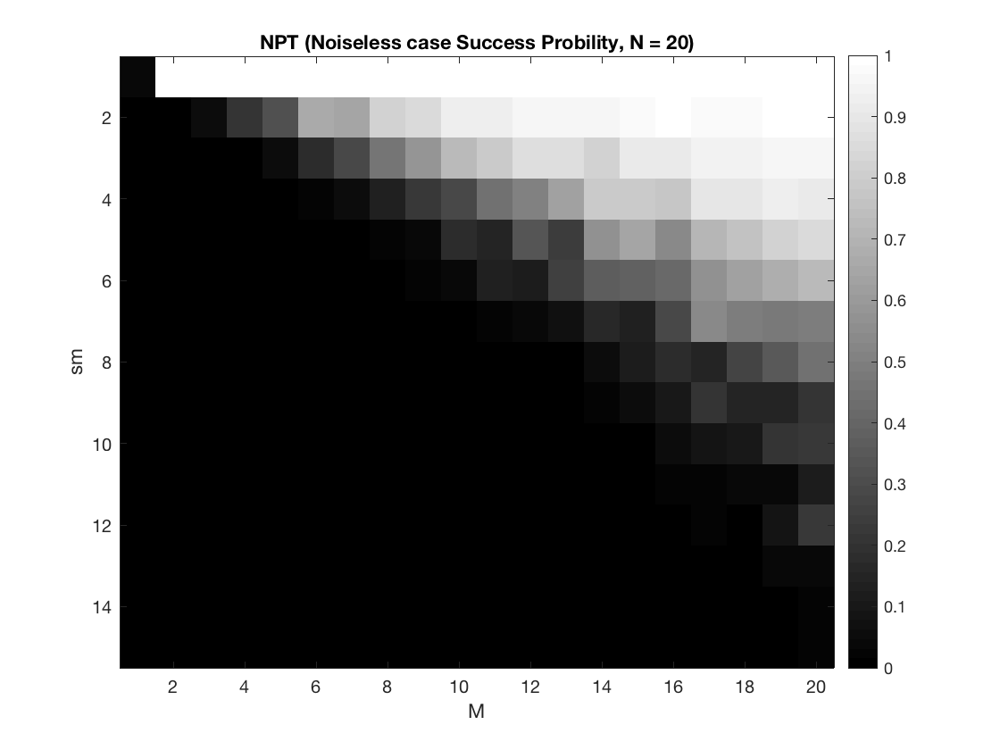

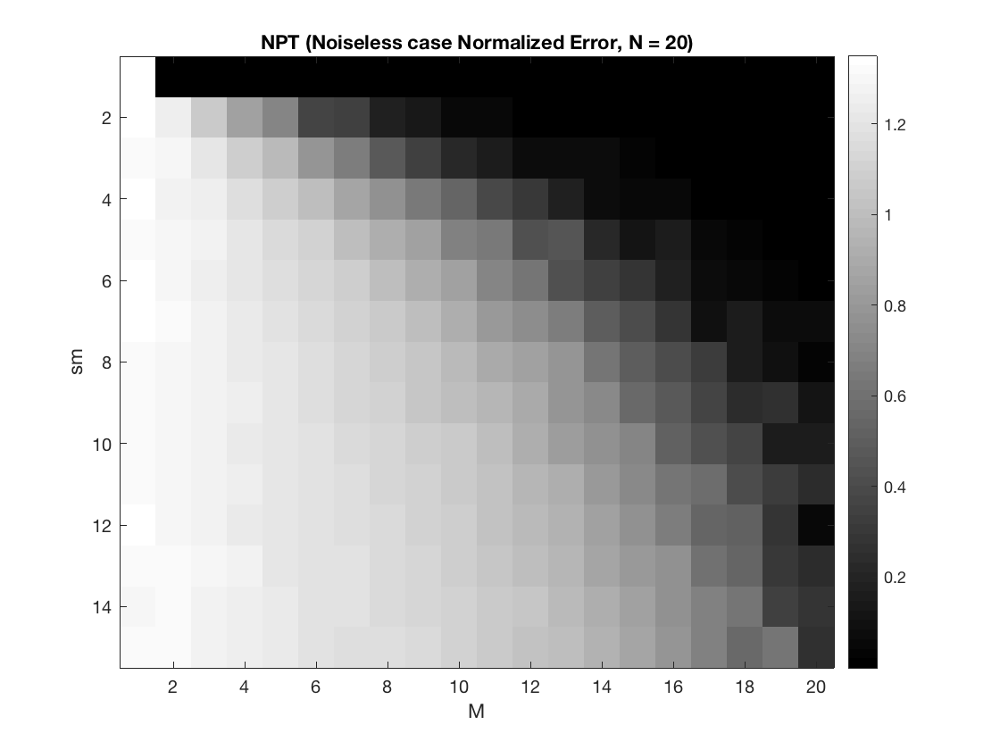

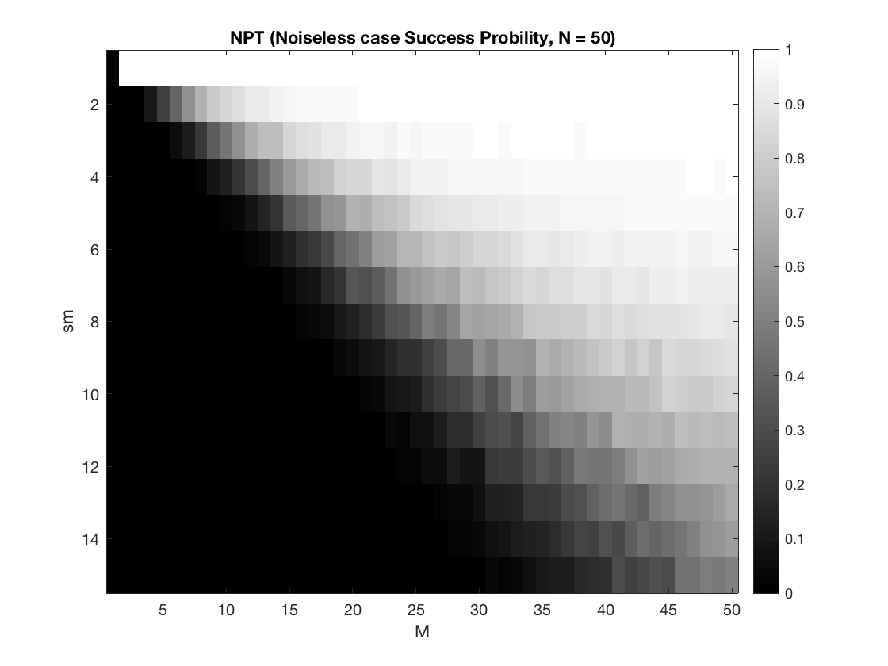

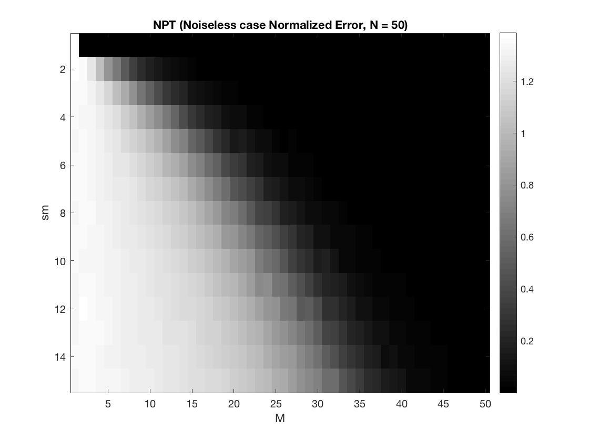

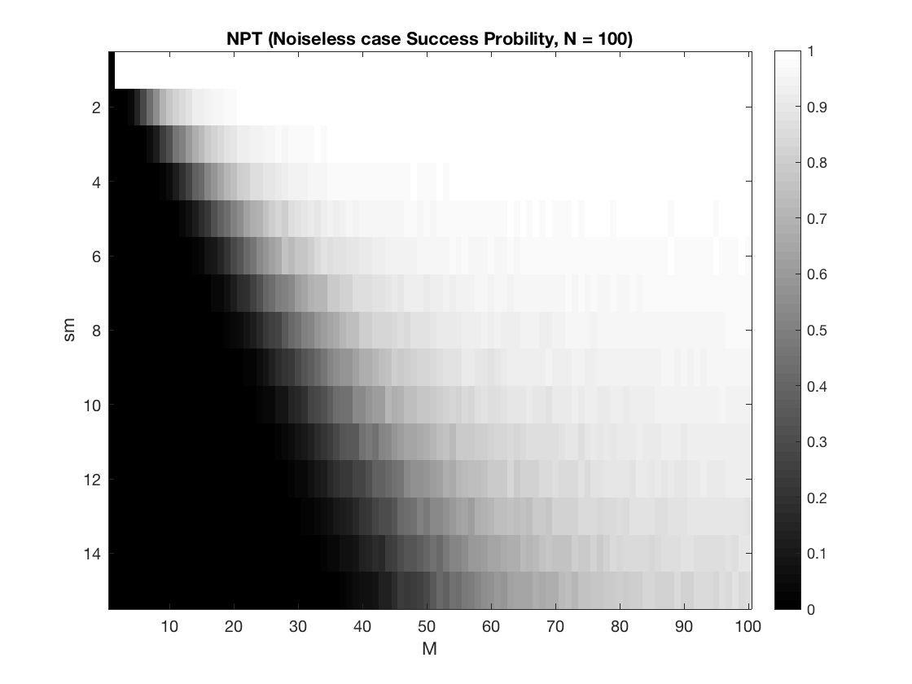

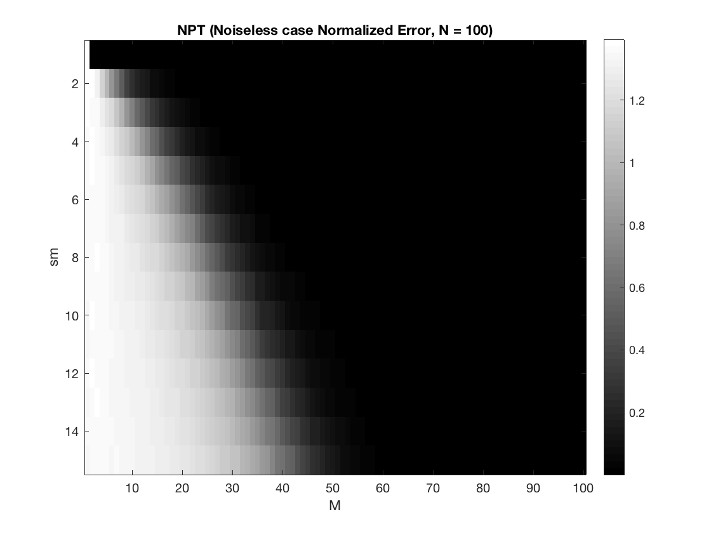

##### Comment:

Firstly, the Normalized Error plot and Success Probability plot are just like reversed to each other. That makes sense, because when error increase, it is less possible to recover the $$x$$ , vice versa.

Secondly, with the **increase** of $$M$$ and **decrease** of $$sm$$ , the error **decrease** and possibility **increase**.

#### (d) Noisy case: ( $\mathbf { n } \neq \mathbf { 0 } $ )

##### 1. Sparsity s is known

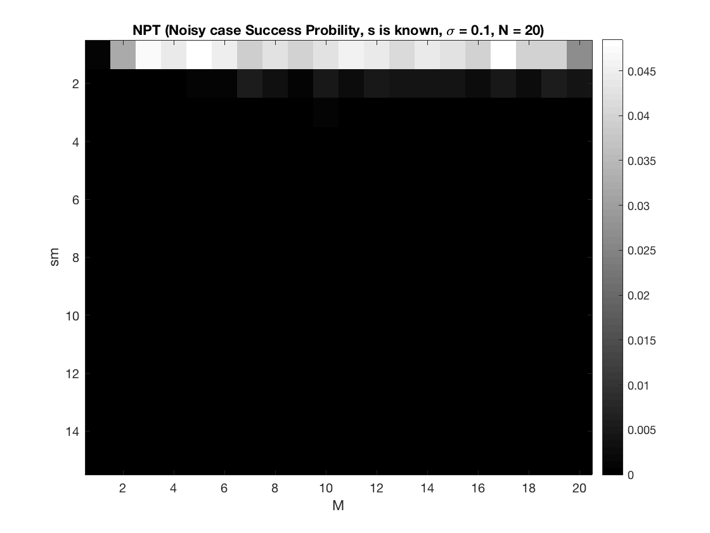

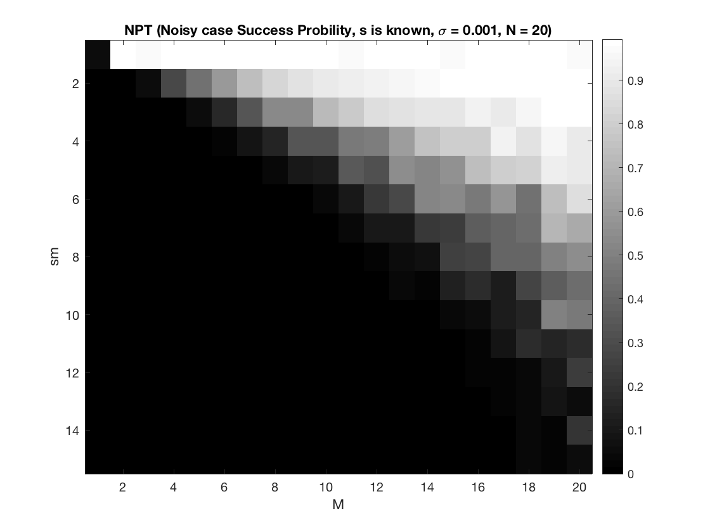

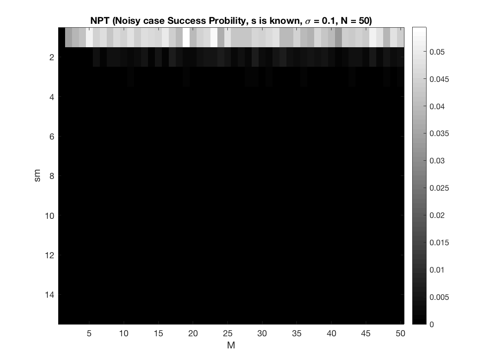

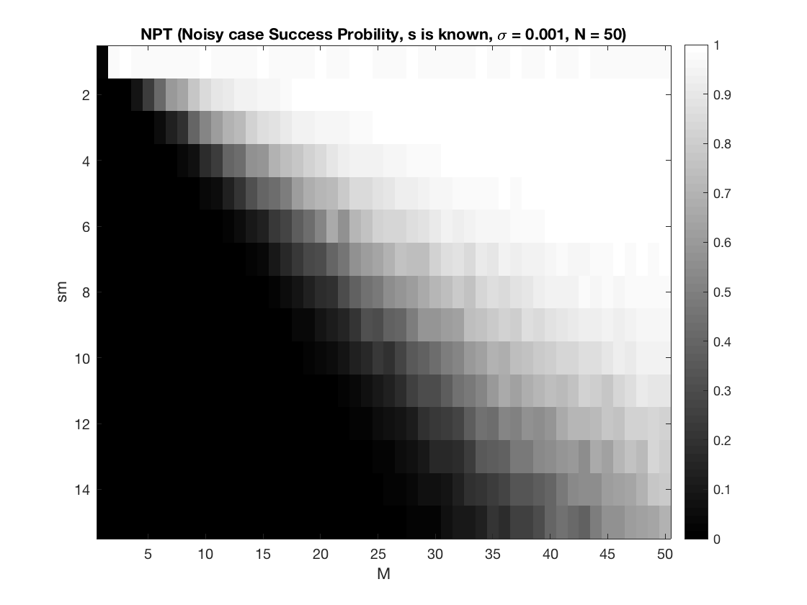

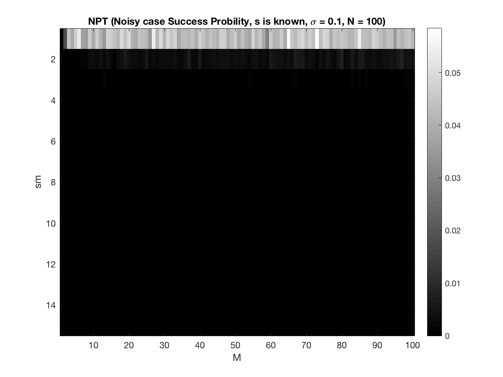

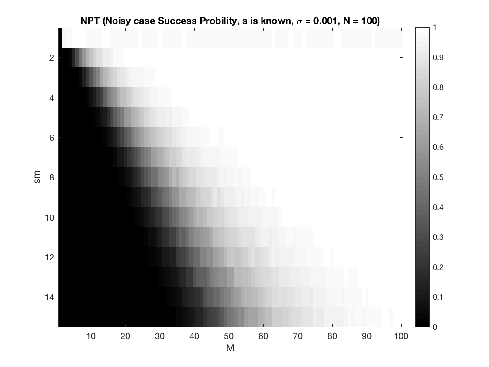

##### Comment:

When the $$\sigma$$ is small, the result is just pretty similar to the **(c)** . But when the $$\sigma$$ is large, it is hard to recover the $$x$$.

##### 2. Sparsity s is NOT known 


##### Comment:

When the $$s$$ is not know but the $$\| \mathbf { n } \| _ { 2 }$$ is known, even with the large $$\sigma $$ , it can recover the $$x$$ in most of situation. But compared with small $$\sigma $$, it still require larger $$M$$ to recover $$x$$.

##### 3. Test OMP on real images


##### Comment:

I chose a real image  and put it into the `dct2()` function in Matlab. To get the **sparse** image, I set a threshold (30), and set those dct value that less than threshold value to 0. The result matrix is the $$X$$, which is the matrix I want to recover. As you can see, the $$X$$ present the **Origin Image**. It tends to be quiet blur, because we filtered the  lower dct value. But to test our OMP, we just regard it as the origin image we want to recover.

Then, I generate a random $$A$$ and noisy $n$ for each loop of OMP. So we have the $$y = A*x + n$$ . Now I need to recover the $$x$$ with $$A$$ and $$y$$. 

Then, I pick every column of $$X$$ and put it into the OMP to get some $$\hat { \mathbf { x } }$$ and use them to construct the recovered  $$\hat { \mathbf { X } }$$. Finally, just use `idct2()` to get the recovered image.

As you can see from the result images, when the $$M$$ is small, the recovered image quality is not good. With the $$M/N$$ reached about $$0.6$$ or larger, the quality is quiet good enough. 

___

#### Source Code

**main.m**

```matlab
clc;
clear;
loop = 2000;
n_sigma = [0.001 0.1];
N = [20 50 100];

% Noiseless case
for i = 1:3
    NPT_0(N(i), loop);
end

% Noisy case s is known
for i = 1:3
    NPT_1(N(i), loop, n_sigma(1));
    NPT_1(N(i), loop, n_sigma(2));
end

% Noisy case s is not known
for i = 1:3
    NPT_2(N(i), loop, n_sigma(1));
    NPT_2(N(i), loop, n_sigma(2));
end

fig = imread('cheetah.bmp');

rec(fig,150,0.001);% input the origin image, M, n_sigma

```

**NPT_0.m**

```matlab
function [] = NPT_0(N,loop)
% Noiseless case
prob = zeros(15, N);    % store the success probility
norm_e = zeros(15, N);  % store the average normalized error
for sm = 1:15
    for M = 1:N
        A = random('Normal',0,1,M,N);
        A = normc(A);
        cnt = 0;
        for q = 1:loop
            S = randperm(N, sm);    % store the x's non-zero entry position
            % generate the random x
            x_val = 1 + 9.*rand([sm 1]);
            x = zeros(N, 1);
            for i=1:sm
               x_val(i) = x_val(i)*(-1)^(randi(2));
            end
            for i=1:sm
               x(S(i)) = x_val(i); 
            end
            S = sort(S);    % sort it to compare more easily
            y = A*x;
            r = y;
            x_h = zeros(N, 1);  % the calculated x
            S_h = zeros(1,sm);  % the calculated non-zero entry position
            span = zeros(M, sm);    % to store chose columns of A
            % OMP
            for k=1:N
                % find the columns of A st max the inner product 
                prod = A'*r;
                [~, S_h(k)] = max(abs(prod));
                % put it into the span
                span(:,k) = A(:, S_h(k));
                % least square
                x_h(S_h(1:k)) = span(:, 1:k)\y;
                r = y - span(:,1:k)*x_h(S_h(1:k));
                e = norm(y - A*x_h);
                if (e < 1)
                   break; 
                end
            end
            norm_e(sm, M) = norm_e(sm, M) + norm(x - x_h)/norm(x);
            % count the times of success
            if size(S)==size(S_h)
                if (S - sort(S_h) == 0)
                   cnt = cnt + 1; 
                end
            end
        end
         prob(sm, M) = cnt/loop;
         norm_e(sm, M) = norm_e(sm, M)/loop;
    end
end

figure;
fig = imagesc(prob);
colormap('gray');
colorbar;
title(['NPT (Noiseless case Success Probility, N = ',mat2str(N),')']);
xlabel('M');
ylabel('sm');
saveas(fig, ['P1SP_N',mat2str(N)]);

figure;
fig = imagesc(norm_e);
colormap('gray');
colorbar;
title(['NPT (Noiseless case Normalized Error, N = ',mat2str(N),')']);
xlabel('M');
ylabel('sm');
saveas(fig, ['P1NE_N',mat2str(N)]);
end
```

**NPT_1.m**

```matlab
function [] = NPT_1(N,loop,ns)
% Noisy case, s is known
prob = zeros(15, N);
norm_e = zeros(15, N);
for sm = 1:15
    for M = 1:N
        A = random('Normal',0,1,M,N);
        A = normc(A);
        cnt = 0;
        for q = 1:loop
            S = randperm(N, sm);
            x_val = 1 + 9.*rand([sm 1]);
            x = zeros(N, 1);
            for i=1:sm
               x_val(i) = x_val(i)*(-1)^(randi(2));
            end
            for i=1:sm
               x(S(i)) = x_val(i); 
            end
            n = random('Normal',0,ns,M,1);
            y = A*x + n;
            r = y;
            x_h = zeros(N, 1);
            S_h = zeros(1,sm);
            span = zeros(M, sm);
            for k=1:sm
                prod = A'*r;
                [~, S_h(k)] = max(abs(prod));
                span(:,k) = A(:, S_h(k));
                x_h(S_h(1:k)) = span(:, 1:k)\y;
                r = y - span(:,1:k)*x_h(S_h(1:k));            
            end
            e = norm(x - x_h)/norm(x);
            norm_e(sm, M) = norm_e(sm, M) + e;
                if (e < 0.001)
                   cnt = cnt + 1;
                end
        end
        prob(sm, M) = cnt/loop;
        norm_e(sm, M) = norm_e(sm, M)/loop;
    end
end
figure;
imagesc(prob);
colormap('gray');
colorbar;
title(['NPT (Noisy case Success Probility, s is known, \sigma = ',mat2str(ns),', N = ',mat2str(N),')']);
xlabel('M');
ylabel('sm');

figure;
imagesc(norm_e);
colormap('gray');
colorbar;
title(['NPT (Noisy case Normalized Error, s is known, \sigma = ',mat2str(ns),', N = ',mat2str(N),')']);
xlabel('M');
ylabel('sm');
end
```

**NPT_2.m**

```matlab
function [] = NPT_2(N,loop,ns)
% Noisy case, s is not known
prob = zeros(15, N);
norm_e = zeros(15, N);
for sm = 1:15
    for M = 1:N
        A = random('Normal',0,1,M,N);
        A = normc(A);
        cnt = 0;
        for q = 1:loop
            S = randperm(N, sm);
            x_val = 1 + 9.*rand([sm 1]);
            x = zeros(N, 1);
            for i=1:sm
               x_val(i) = x_val(i)*(-1)^(randi(2));
            end
            for i=1:sm
               x(S(i)) = x_val(i); 
            end
            S = sort(S);
            n = random('Normal',0,ns,M,1);
            n_norm = norm(n);
            y = A*x + n;
            r = y;
            x_h = zeros(N, 1);
            S_h = zeros(1,sm);
            span = zeros(M, sm);
            for k=1:N
                prod = A'*r;
                [~, S_h(k)] = max(abs(prod));
                span(:,k) = A(:, S_h(k));
                x_h(S_h(1:k)) = span(:, 1:k)\y;
                r = y - span(:,1:k)*x_h(S_h(1:k));
                e = norm(y - A*x_h);
                if (e < n_norm)
                   break; 
                end
            end
            norm_e(sm, M) = norm_e(sm, M) + norm(x - x_h)/norm(x);
            if size(S)==size(S_h)
                if (S - sort(S_h) == 0)
                   cnt = cnt + 1; 
                end
            end
        end
         prob(sm, M) = cnt/loop;
         norm_e(sm, M) = norm_e(sm, M)/loop;
    end
end
figure;
imagesc(prob);
colormap('gray');
colorbar;
title(['NPT (Noisy case Success Probility, s is not known, \sigma = ',mat2str(ns),', N = ',mat2str(N),')']);
xlabel('M');
ylabel('sm');

figure;
imagesc(norm_e);
colormap('gray');
colorbar;
title(['NPT (Noisy case Normalized Error, s is not known, \sigma = ',mat2str(ns),', N = ',mat2str(N),')']);
xlabel('M');
ylabel('sm');
end
```

**rec.m**

```matlab
function [] = rec(fig,M,ns)
% recover the image
X = dct2(fig);
X(abs(X)<30) = 0;	% filter the image to get the sparse image
figure;
fig = idct2(X);
imagesc(fig);
colormap(gray(255));
title('Origin Image');
[row, col] = size(X);
N = row;
X_h = zeros(row, col);	% the recovered image
Y = zeros(M, col);
for i = 1:col
    A = random('Normal',0,1,M,N);
    A = normc(A);
    n = random('Normal',0,ns,M,1);
    y = A*X(:,i) + n;
    Y(:,i) = y;
    r = y;
    x_h = zeros(N, 1);
    S_h = zeros(1,N);
    span = zeros(M, N);
    for k=1:N
        prod = A'*r;
        [~, S_h(k)] = max(abs(prod));
        span(:,k) = A(:, S_h(k));
        x_h(S_h(1:k)) = span(:, 1:k)\y;
        r = y - span(:,1:k)*x_h(S_h(1:k));
    end
    X_h(:,i) = x_h;
end
fig = idct2(Y);
figure;
imagesc(fig);
colormap(gray(255));
title('Corrupt Image');

fig_rec = idct2(X_h);
figure;
imagesc(fig_rec);
colormap(gray(255));
title(['Recovered Image','(M = ',mat2str(M),', N = ',mat2str(N),')']);
end


```

